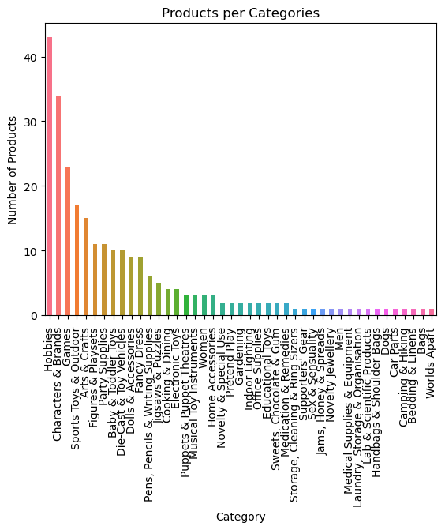

## Importing libraries


```python
import pandas as pd

import numpy as np

import matplotlib.pyplot as plt

import seaborn as sns
```

## Reading file


```python
df = pd.read_csv(r'C:\Users\lika_\OneDrive\Рабочий стол\Data Analyst Projects\Final project\Prepared data\amazon_co-ecommerce_sample_edited.csv')
```


```python
df.head()
```


<div>
<style scoped>
    .dataframe tbody tr th:only-of-type {
        vertical-align: middle;
    }

    .dataframe tbody tr th {
        vertical-align: top;
    }

    .dataframe thead th {
        text-align: right;
    }
</style>
<table border="1" class="dataframe">
  <thead>
    <tr style="text-align: right;">
      <th></th>
      <th>index</th>
      <th>uniq_id</th>
      <th>product_name</th>
      <th>manufacturer</th>
      <th>price</th>
      <th>number_available_in_stock</th>
      <th>number_of_reviews</th>
      <th>number_of_answered_questions</th>
      <th>average_review_rating</th>
      <th>amazon_category_and_sub_category</th>
      <th>customers_who_bought_this_item_also_bought</th>
      <th>description</th>
      <th>product_information</th>
      <th>product_description</th>
      <th>items_customers_buy_after_viewing_this_item</th>
      <th>customer_questions_and_answers</th>
      <th>customer_reviews</th>
      <th>sellers</th>
    </tr>
  </thead>
  <tbody>
    <tr>
      <th>0</th>
      <td>0</td>
      <td>eac7efa5dbd3d667f26eb3d3ab504464</td>
      <td>Hornby 2014 Catalogue</td>
      <td>Hornby</td>
      <td>£3.42</td>
      <td>5 new</td>
      <td>15</td>
      <td>1.0</td>
      <td>4.9 out of 5 stars</td>
      <td>Hobbies &gt; Model Trains &amp; Railway Sets &gt; Rail V...</td>
      <td>http://www.amazon.co.uk/Hornby-R8150-Catalogue...</td>
      <td>Product Description Hornby 2014 Catalogue Box ...</td>
      <td>Technical Details Item Weight640 g Product Dim...</td>
      <td>Product Description Hornby 2014 Catalogue Box ...</td>
      <td>http://www.amazon.co.uk/Hornby-R8150-Catalogue...</td>
      <td>Does this catalogue detail all the previous Ho...</td>
      <td>Worth Buying For The Pictures Alone (As Ever) ...</td>
      <td>{"seller"=&gt;[{"Seller_name_1"=&gt;"Amazon.co.uk", ...</td>
    </tr>
    <tr>
      <th>1</th>
      <td>1</td>
      <td>b17540ef7e86e461d37f3ae58b7b72ac</td>
      <td>FunkyBuys® Large Christmas Holiday Express Fes...</td>
      <td>FunkyBuys</td>
      <td>£16.99</td>
      <td>NaN</td>
      <td>2</td>
      <td>1.0</td>
      <td>4.5 out of 5 stars</td>
      <td>Hobbies &gt; Model Trains &amp; Railway Sets &gt; Rail V...</td>
      <td>http://www.amazon.co.uk/Christmas-Holiday-Expr...</td>
      <td>Size Name:Large FunkyBuys® Large Christmas Hol...</td>
      <td>Technical Details Manufacturer recommended age...</td>
      <td>Size Name:Large FunkyBuys® Large Christmas Hol...</td>
      <td>http://www.amazon.co.uk/Christmas-Holiday-Expr...</td>
      <td>can you turn off sounds // hi no you cant turn...</td>
      <td>Four Stars // 4.0 // 18 Dec. 2015 // By\n    \...</td>
      <td>{"seller"=&gt;{"Seller_name_1"=&gt;"UHD WHOLESALE", ...</td>
    </tr>
    <tr>
      <th>2</th>
      <td>2</td>
      <td>348f344247b0c1a935b1223072ef9d8a</td>
      <td>CLASSIC TOY TRAIN SET TRACK CARRIAGES LIGHT EN...</td>
      <td>ccf</td>
      <td>£9.99</td>
      <td>2 new</td>
      <td>17</td>
      <td>2.0</td>
      <td>3.9 out of 5 stars</td>
      <td>Hobbies &gt; Model Trains &amp; Railway Sets &gt; Rail V...</td>
      <td>http://www.amazon.co.uk/Classic-Train-Lights-B...</td>
      <td>BIG CLASSIC TOY TRAIN SET TRACK CARRIAGE LIGHT...</td>
      <td>Technical Details Manufacturer recommended age...</td>
      <td>BIG CLASSIC TOY TRAIN SET TRACK CARRIAGE LIGHT...</td>
      <td>http://www.amazon.co.uk/Train-With-Tracks-Batt...</td>
      <td>What is the gauge of the track // Hi Paul.Trut...</td>
      <td>**Highly Recommended!** // 5.0 // 26 May 2015 ...</td>
      <td>{"seller"=&gt;[{"Seller_name_1"=&gt;"DEAL-BOX", "Sel...</td>
    </tr>
    <tr>
      <th>3</th>
      <td>3</td>
      <td>e12b92dbb8eaee78b22965d2a9bbbd9f</td>
      <td>HORNBY Coach R4410A BR Hawksworth Corridor 3rd</td>
      <td>Hornby</td>
      <td>£39.99</td>
      <td>NaN</td>
      <td>1</td>
      <td>2.0</td>
      <td>5.0 out of 5 stars</td>
      <td>Hobbies &gt; Model Trains &amp; Railway Sets &gt; Rail V...</td>
      <td>NaN</td>
      <td>Hornby 00 Gauge BR Hawksworth 3rd Class W 2107...</td>
      <td>Technical Details Item Weight259 g Product Dim...</td>
      <td>Hornby 00 Gauge BR Hawksworth 3rd Class W 2107...</td>
      <td>NaN</td>
      <td>NaN</td>
      <td>I love it // 5.0 // 22 July 2013 // By\n    \n...</td>
      <td>NaN</td>
    </tr>
    <tr>
      <th>4</th>
      <td>4</td>
      <td>e33a9adeed5f36840ccc227db4682a36</td>
      <td>Hornby 00 Gauge 0-4-0 Gildenlow Salt Co. Steam...</td>
      <td>Hornby</td>
      <td>£32.19</td>
      <td>NaN</td>
      <td>3</td>
      <td>2.0</td>
      <td>4.7 out of 5 stars</td>
      <td>Hobbies &gt; Model Trains &amp; Railway Sets &gt; Rail V...</td>
      <td>http://www.amazon.co.uk/Hornby-R6367-RailRoad-...</td>
      <td>Product Description Hornby RailRoad 0-4-0 Gild...</td>
      <td>Technical Details Item Weight159 g Product Dim...</td>
      <td>Product Description Hornby RailRoad 0-4-0 Gild...</td>
      <td>http://www.amazon.co.uk/Hornby-R2672-RailRoad-...</td>
      <td>NaN</td>
      <td>Birthday present // 5.0 // 14 April 2014 // By...</td>
      <td>NaN</td>
    </tr>
  </tbody>
</table>
</div>


```python
df.shape
```


    (10000, 18)


```python
df.dtypes
```


    index                                            int64
    uniq_id                                         object
    product_name                                    object
    manufacturer                                    object
    price                                           object
    number_available_in_stock                       object
    number_of_reviews                               object
    number_of_answered_questions                   float64
    average_review_rating                           object
    amazon_category_and_sub_category                object
    customers_who_bought_this_item_also_bought      object
    description                                     object
    product_information                             object
    product_description                             object
    items_customers_buy_after_viewing_this_item     object
    customer_questions_and_answers                  object
    customer_reviews                                object
    sellers                                         object
    dtype: object


## Cleaning data


```python
df = df.set_index('index')
```


```python
df.head()
```


<div>
<style scoped>
    .dataframe tbody tr th:only-of-type {
        vertical-align: middle;
    }

    .dataframe tbody tr th {
        vertical-align: top;
    }

    .dataframe thead th {
        text-align: right;
    }
</style>
<table border="1" class="dataframe">
  <thead>
    <tr style="text-align: right;">
      <th></th>
      <th>uniq_id</th>
      <th>product_name</th>
      <th>manufacturer</th>
      <th>price</th>
      <th>number_available_in_stock</th>
      <th>number_of_reviews</th>
      <th>number_of_answered_questions</th>
      <th>average_review_rating</th>
      <th>amazon_category_and_sub_category</th>
      <th>customers_who_bought_this_item_also_bought</th>
      <th>description</th>
      <th>product_information</th>
      <th>product_description</th>
      <th>items_customers_buy_after_viewing_this_item</th>
      <th>customer_questions_and_answers</th>
      <th>customer_reviews</th>
      <th>sellers</th>
    </tr>
    <tr>
      <th>index</th>
      <th></th>
      <th></th>
      <th></th>
      <th></th>
      <th></th>
      <th></th>
      <th></th>
      <th></th>
      <th></th>
      <th></th>
      <th></th>
      <th></th>
      <th></th>
      <th></th>
      <th></th>
      <th></th>
      <th></th>
    </tr>
  </thead>
  <tbody>
    <tr>
      <th>0</th>
      <td>eac7efa5dbd3d667f26eb3d3ab504464</td>
      <td>Hornby 2014 Catalogue</td>
      <td>Hornby</td>
      <td>£3.42</td>
      <td>5 new</td>
      <td>15</td>
      <td>1.0</td>
      <td>4.9 out of 5 stars</td>
      <td>Hobbies &gt; Model Trains &amp; Railway Sets &gt; Rail V...</td>
      <td>http://www.amazon.co.uk/Hornby-R8150-Catalogue...</td>
      <td>Product Description Hornby 2014 Catalogue Box ...</td>
      <td>Technical Details Item Weight640 g Product Dim...</td>
      <td>Product Description Hornby 2014 Catalogue Box ...</td>
      <td>http://www.amazon.co.uk/Hornby-R8150-Catalogue...</td>
      <td>Does this catalogue detail all the previous Ho...</td>
      <td>Worth Buying For The Pictures Alone (As Ever) ...</td>
      <td>{"seller"=&gt;[{"Seller_name_1"=&gt;"Amazon.co.uk", ...</td>
    </tr>
    <tr>
      <th>1</th>
      <td>b17540ef7e86e461d37f3ae58b7b72ac</td>
      <td>FunkyBuys® Large Christmas Holiday Express Fes...</td>
      <td>FunkyBuys</td>
      <td>£16.99</td>
      <td>NaN</td>
      <td>2</td>
      <td>1.0</td>
      <td>4.5 out of 5 stars</td>
      <td>Hobbies &gt; Model Trains &amp; Railway Sets &gt; Rail V...</td>
      <td>http://www.amazon.co.uk/Christmas-Holiday-Expr...</td>
      <td>Size Name:Large FunkyBuys® Large Christmas Hol...</td>
      <td>Technical Details Manufacturer recommended age...</td>
      <td>Size Name:Large FunkyBuys® Large Christmas Hol...</td>
      <td>http://www.amazon.co.uk/Christmas-Holiday-Expr...</td>
      <td>can you turn off sounds // hi no you cant turn...</td>
      <td>Four Stars // 4.0 // 18 Dec. 2015 // By\n    \...</td>
      <td>{"seller"=&gt;{"Seller_name_1"=&gt;"UHD WHOLESALE", ...</td>
    </tr>
    <tr>
      <th>2</th>
      <td>348f344247b0c1a935b1223072ef9d8a</td>
      <td>CLASSIC TOY TRAIN SET TRACK CARRIAGES LIGHT EN...</td>
      <td>ccf</td>
      <td>£9.99</td>
      <td>2 new</td>
      <td>17</td>
      <td>2.0</td>
      <td>3.9 out of 5 stars</td>
      <td>Hobbies &gt; Model Trains &amp; Railway Sets &gt; Rail V...</td>
      <td>http://www.amazon.co.uk/Classic-Train-Lights-B...</td>
      <td>BIG CLASSIC TOY TRAIN SET TRACK CARRIAGE LIGHT...</td>
      <td>Technical Details Manufacturer recommended age...</td>
      <td>BIG CLASSIC TOY TRAIN SET TRACK CARRIAGE LIGHT...</td>
      <td>http://www.amazon.co.uk/Train-With-Tracks-Batt...</td>
      <td>What is the gauge of the track // Hi Paul.Trut...</td>
      <td>**Highly Recommended!** // 5.0 // 26 May 2015 ...</td>
      <td>{"seller"=&gt;[{"Seller_name_1"=&gt;"DEAL-BOX", "Sel...</td>
    </tr>
    <tr>
      <th>3</th>
      <td>e12b92dbb8eaee78b22965d2a9bbbd9f</td>
      <td>HORNBY Coach R4410A BR Hawksworth Corridor 3rd</td>
      <td>Hornby</td>
      <td>£39.99</td>
      <td>NaN</td>
      <td>1</td>
      <td>2.0</td>
      <td>5.0 out of 5 stars</td>
      <td>Hobbies &gt; Model Trains &amp; Railway Sets &gt; Rail V...</td>
      <td>NaN</td>
      <td>Hornby 00 Gauge BR Hawksworth 3rd Class W 2107...</td>
      <td>Technical Details Item Weight259 g Product Dim...</td>
      <td>Hornby 00 Gauge BR Hawksworth 3rd Class W 2107...</td>
      <td>NaN</td>
      <td>NaN</td>
      <td>I love it // 5.0 // 22 July 2013 // By\n    \n...</td>
      <td>NaN</td>
    </tr>
    <tr>
      <th>4</th>
      <td>e33a9adeed5f36840ccc227db4682a36</td>
      <td>Hornby 00 Gauge 0-4-0 Gildenlow Salt Co. Steam...</td>
      <td>Hornby</td>
      <td>£32.19</td>
      <td>NaN</td>
      <td>3</td>
      <td>2.0</td>
      <td>4.7 out of 5 stars</td>
      <td>Hobbies &gt; Model Trains &amp; Railway Sets &gt; Rail V...</td>
      <td>http://www.amazon.co.uk/Hornby-R6367-RailRoad-...</td>
      <td>Product Description Hornby RailRoad 0-4-0 Gild...</td>
      <td>Technical Details Item Weight159 g Product Dim...</td>
      <td>Product Description Hornby RailRoad 0-4-0 Gild...</td>
      <td>http://www.amazon.co.uk/Hornby-R2672-RailRoad-...</td>
      <td>NaN</td>
      <td>Birthday present // 5.0 // 14 April 2014 // By...</td>
      <td>NaN</td>
    </tr>
  </tbody>
</table>
</div>


```python
## Deleting unnecessary columns and duplicates.

df.columns
```


    Index(['uniq_id', 'product_name', 'manufacturer', 'price',
           'number_available_in_stock', 'number_of_reviews',
           'number_of_answered_questions', 'average_review_rating',
           'amazon_category_and_sub_category',
           'customers_who_bought_this_item_also_bought', 'description',
           'product_information', 'product_description',
           'items_customers_buy_after_viewing_this_item',
           'customer_questions_and_answers', 'customer_reviews', 'sellers'],
          dtype='object')


```python
columns_to_drop = ['number_available_in_stock','customers_who_bought_this_item_also_bought','product_information', 'product_description','items_customers_buy_after_viewing_this_item','sellers']
df = df.drop(columns = columns_to_drop)
```


```python
df.head()
```


<div>
<style scoped>
    .dataframe tbody tr th:only-of-type {
        vertical-align: middle;
    }

    .dataframe tbody tr th {
        vertical-align: top;
    }

    .dataframe thead th {
        text-align: right;
    }
</style>
<table border="1" class="dataframe">
  <thead>
    <tr style="text-align: right;">
      <th></th>
      <th>uniq_id</th>
      <th>product_name</th>
      <th>manufacturer</th>
      <th>price</th>
      <th>number_of_reviews</th>
      <th>number_of_answered_questions</th>
      <th>average_review_rating</th>
      <th>amazon_category_and_sub_category</th>
      <th>description</th>
      <th>customer_questions_and_answers</th>
      <th>customer_reviews</th>
    </tr>
    <tr>
      <th>index</th>
      <th></th>
      <th></th>
      <th></th>
      <th></th>
      <th></th>
      <th></th>
      <th></th>
      <th></th>
      <th></th>
      <th></th>
      <th></th>
    </tr>
  </thead>
  <tbody>
    <tr>
      <th>0</th>
      <td>eac7efa5dbd3d667f26eb3d3ab504464</td>
      <td>Hornby 2014 Catalogue</td>
      <td>Hornby</td>
      <td>£3.42</td>
      <td>15</td>
      <td>1.0</td>
      <td>4.9 out of 5 stars</td>
      <td>Hobbies &gt; Model Trains &amp; Railway Sets &gt; Rail V...</td>
      <td>Product Description Hornby 2014 Catalogue Box ...</td>
      <td>Does this catalogue detail all the previous Ho...</td>
      <td>Worth Buying For The Pictures Alone (As Ever) ...</td>
    </tr>
    <tr>
      <th>1</th>
      <td>b17540ef7e86e461d37f3ae58b7b72ac</td>
      <td>FunkyBuys® Large Christmas Holiday Express Fes...</td>
      <td>FunkyBuys</td>
      <td>£16.99</td>
      <td>2</td>
      <td>1.0</td>
      <td>4.5 out of 5 stars</td>
      <td>Hobbies &gt; Model Trains &amp; Railway Sets &gt; Rail V...</td>
      <td>Size Name:Large FunkyBuys® Large Christmas Hol...</td>
      <td>can you turn off sounds // hi no you cant turn...</td>
      <td>Four Stars // 4.0 // 18 Dec. 2015 // By\n    \...</td>
    </tr>
    <tr>
      <th>2</th>
      <td>348f344247b0c1a935b1223072ef9d8a</td>
      <td>CLASSIC TOY TRAIN SET TRACK CARRIAGES LIGHT EN...</td>
      <td>ccf</td>
      <td>£9.99</td>
      <td>17</td>
      <td>2.0</td>
      <td>3.9 out of 5 stars</td>
      <td>Hobbies &gt; Model Trains &amp; Railway Sets &gt; Rail V...</td>
      <td>BIG CLASSIC TOY TRAIN SET TRACK CARRIAGE LIGHT...</td>
      <td>What is the gauge of the track // Hi Paul.Trut...</td>
      <td>**Highly Recommended!** // 5.0 // 26 May 2015 ...</td>
    </tr>
    <tr>
      <th>3</th>
      <td>e12b92dbb8eaee78b22965d2a9bbbd9f</td>
      <td>HORNBY Coach R4410A BR Hawksworth Corridor 3rd</td>
      <td>Hornby</td>
      <td>£39.99</td>
      <td>1</td>
      <td>2.0</td>
      <td>5.0 out of 5 stars</td>
      <td>Hobbies &gt; Model Trains &amp; Railway Sets &gt; Rail V...</td>
      <td>Hornby 00 Gauge BR Hawksworth 3rd Class W 2107...</td>
      <td>NaN</td>
      <td>I love it // 5.0 // 22 July 2013 // By\n    \n...</td>
    </tr>
    <tr>
      <th>4</th>
      <td>e33a9adeed5f36840ccc227db4682a36</td>
      <td>Hornby 00 Gauge 0-4-0 Gildenlow Salt Co. Steam...</td>
      <td>Hornby</td>
      <td>£32.19</td>
      <td>3</td>
      <td>2.0</td>
      <td>4.7 out of 5 stars</td>
      <td>Hobbies &gt; Model Trains &amp; Railway Sets &gt; Rail V...</td>
      <td>Product Description Hornby RailRoad 0-4-0 Gild...</td>
      <td>NaN</td>
      <td>Birthday present // 5.0 // 14 April 2014 // By...</td>
    </tr>
  </tbody>
</table>
</div>


```python
df.drop_duplicates()
```


<div>
<style scoped>
    .dataframe tbody tr th:only-of-type {
        vertical-align: middle;
    }

    .dataframe tbody tr th {
        vertical-align: top;
    }

    .dataframe thead th {
        text-align: right;
    }
</style>
<table border="1" class="dataframe">
  <thead>
    <tr style="text-align: right;">
      <th></th>
      <th>uniq_id</th>
      <th>product_name</th>
      <th>manufacturer</th>
      <th>price</th>
      <th>number_of_reviews</th>
      <th>number_of_answered_questions</th>
      <th>average_review_rating</th>
      <th>amazon_category_and_sub_category</th>
      <th>description</th>
      <th>customer_questions_and_answers</th>
      <th>customer_reviews</th>
    </tr>
    <tr>
      <th>index</th>
      <th></th>
      <th></th>
      <th></th>
      <th></th>
      <th></th>
      <th></th>
      <th></th>
      <th></th>
      <th></th>
      <th></th>
      <th></th>
    </tr>
  </thead>
  <tbody>
    <tr>
      <th>0</th>
      <td>eac7efa5dbd3d667f26eb3d3ab504464</td>
      <td>Hornby 2014 Catalogue</td>
      <td>Hornby</td>
      <td>£3.42</td>
      <td>15</td>
      <td>1.0</td>
      <td>4.9 out of 5 stars</td>
      <td>Hobbies &gt; Model Trains &amp; Railway Sets &gt; Rail V...</td>
      <td>Product Description Hornby 2014 Catalogue Box ...</td>
      <td>Does this catalogue detail all the previous Ho...</td>
      <td>Worth Buying For The Pictures Alone (As Ever) ...</td>
    </tr>
    <tr>
      <th>1</th>
      <td>b17540ef7e86e461d37f3ae58b7b72ac</td>
      <td>FunkyBuys® Large Christmas Holiday Express Fes...</td>
      <td>FunkyBuys</td>
      <td>£16.99</td>
      <td>2</td>
      <td>1.0</td>
      <td>4.5 out of 5 stars</td>
      <td>Hobbies &gt; Model Trains &amp; Railway Sets &gt; Rail V...</td>
      <td>Size Name:Large FunkyBuys® Large Christmas Hol...</td>
      <td>can you turn off sounds // hi no you cant turn...</td>
      <td>Four Stars // 4.0 // 18 Dec. 2015 // By\n    \...</td>
    </tr>
    <tr>
      <th>2</th>
      <td>348f344247b0c1a935b1223072ef9d8a</td>
      <td>CLASSIC TOY TRAIN SET TRACK CARRIAGES LIGHT EN...</td>
      <td>ccf</td>
      <td>£9.99</td>
      <td>17</td>
      <td>2.0</td>
      <td>3.9 out of 5 stars</td>
      <td>Hobbies &gt; Model Trains &amp; Railway Sets &gt; Rail V...</td>
      <td>BIG CLASSIC TOY TRAIN SET TRACK CARRIAGE LIGHT...</td>
      <td>What is the gauge of the track // Hi Paul.Trut...</td>
      <td>**Highly Recommended!** // 5.0 // 26 May 2015 ...</td>
    </tr>
    <tr>
      <th>3</th>
      <td>e12b92dbb8eaee78b22965d2a9bbbd9f</td>
      <td>HORNBY Coach R4410A BR Hawksworth Corridor 3rd</td>
      <td>Hornby</td>
      <td>£39.99</td>
      <td>1</td>
      <td>2.0</td>
      <td>5.0 out of 5 stars</td>
      <td>Hobbies &gt; Model Trains &amp; Railway Sets &gt; Rail V...</td>
      <td>Hornby 00 Gauge BR Hawksworth 3rd Class W 2107...</td>
      <td>NaN</td>
      <td>I love it // 5.0 // 22 July 2013 // By\n    \n...</td>
    </tr>
    <tr>
      <th>4</th>
      <td>e33a9adeed5f36840ccc227db4682a36</td>
      <td>Hornby 00 Gauge 0-4-0 Gildenlow Salt Co. Steam...</td>
      <td>Hornby</td>
      <td>£32.19</td>
      <td>3</td>
      <td>2.0</td>
      <td>4.7 out of 5 stars</td>
      <td>Hobbies &gt; Model Trains &amp; Railway Sets &gt; Rail V...</td>
      <td>Product Description Hornby RailRoad 0-4-0 Gild...</td>
      <td>NaN</td>
      <td>Birthday present // 5.0 // 14 April 2014 // By...</td>
    </tr>
    <tr>
      <th>...</th>
      <td>...</td>
      <td>...</td>
      <td>...</td>
      <td>...</td>
      <td>...</td>
      <td>...</td>
      <td>...</td>
      <td>...</td>
      <td>...</td>
      <td>...</td>
      <td>...</td>
    </tr>
    <tr>
      <th>9995</th>
      <td>44d6967f083825a5de36ad4865a65bcd</td>
      <td>Batman 1966 TV Series Action Figures - The Rid...</td>
      <td>Mattel</td>
      <td>£22.95</td>
      <td>3</td>
      <td>3.0</td>
      <td>5.0 out of 5 stars</td>
      <td>Hobbies &gt; Collectible Figures &amp; Memorabilia &gt; ...</td>
      <td>DC 66 Batman Classic TV Series 6 Inch Riddler ...</td>
      <td>NaN</td>
      <td>Realistic // 5.0 // 31 Mar. 2014 // By\n    \n...</td>
    </tr>
    <tr>
      <th>9996</th>
      <td>08f0747b6fc6687215ffb994c3a6fb32</td>
      <td>Star Wars Costume, Kids Stormtrooper Costume S...</td>
      <td>Star Wars</td>
      <td>£39.99</td>
      <td>1</td>
      <td>3.0</td>
      <td>4.0 out of 5 stars</td>
      <td>Characters &amp; Brands &gt; Star Wars &gt; Toys</td>
      <td>NaN</td>
      <td>NaN</td>
      <td>... what I see my grandson us going to have fu...</td>
    </tr>
    <tr>
      <th>9997</th>
      <td>bf6cc073f8f24e6e338190fa16f6ee9d</td>
      <td>Defiance Lawkeeper Metal Badge Prop Replica</td>
      <td>Olde Scotland Yard Ltd.</td>
      <td>£43.99</td>
      <td>1</td>
      <td>3.0</td>
      <td>5.0 out of 5 stars</td>
      <td>Novelty &amp; Special Use &gt; Novelty &gt; Accessories ...</td>
      <td>*Includes 1x Badge with holder and chain *High...</td>
      <td>NaN</td>
      <td>Five Stars // 5.0 // 18 Dec. 2015 // By\n    \...</td>
    </tr>
    <tr>
      <th>9998</th>
      <td>cd783d0b8b44e631b9788b203eaaefae</td>
      <td>Justice League of America Series 3 Green Lante...</td>
      <td>DC Comics</td>
      <td>£49.81</td>
      <td>1</td>
      <td>3.0</td>
      <td>5.0 out of 5 stars</td>
      <td>Hobbies &gt; Collectible Figures &amp; Memorabilia &gt; ...</td>
      <td>Designed by Ed BenesIt's here - the third seri...</td>
      <td>NaN</td>
      <td>The best sculpt in a while // 5.0 // 13 May 20...</td>
    </tr>
    <tr>
      <th>9999</th>
      <td>94d18e86e504bee1e392df7e5738b18a</td>
      <td>Star Wars 1/72 Y-Wing Starfighter</td>
      <td>Bandai</td>
      <td>£21.20</td>
      <td>11</td>
      <td>3.0</td>
      <td>4.5 out of 5 stars</td>
      <td>Characters &amp; Brands &gt; Star Wars &gt; Toys</td>
      <td>NaN</td>
      <td>NaN</td>
      <td>Gold leader // 5.0 // 31 Aug. 2015 // By\n    ...</td>
    </tr>
  </tbody>
</table>
<p>10000 rows × 11 columns</p>
</div>


## Analyzing data


```python
##Let's check which category of products is most represented on Amazon according to this data.

## Creating copy to work with

df2 = df
```


```python
## Checking which categories we have in our dataset.

df_categories = df2.groupby('amazon_category_and_sub_category').count()
```


```python
df_categories.head(255)
```


<div>
<style scoped>
    .dataframe tbody tr th:only-of-type {
        vertical-align: middle;
    }

    .dataframe tbody tr th {
        vertical-align: top;
    }

    .dataframe thead th {
        text-align: right;
    }
</style>
<table border="1" class="dataframe">
  <thead>
    <tr style="text-align: right;">
      <th></th>
      <th>uniq_id</th>
      <th>product_name</th>
      <th>manufacturer</th>
      <th>price</th>
      <th>number_of_reviews</th>
      <th>number_of_answered_questions</th>
      <th>average_review_rating</th>
      <th>description</th>
      <th>customer_questions_and_answers</th>
      <th>customer_reviews</th>
    </tr>
    <tr>
      <th>amazon_category_and_sub_category</th>
      <th></th>
      <th></th>
      <th></th>
      <th></th>
      <th></th>
      <th></th>
      <th></th>
      <th></th>
      <th></th>
      <th></th>
    </tr>
  </thead>
  <tbody>
    <tr>
      <th>Arts &amp; Crafts &gt; Art &amp; Craft Supplies &gt; Glitter</th>
      <td>1</td>
      <td>1</td>
      <td>1</td>
      <td>1</td>
      <td>1</td>
      <td>1</td>
      <td>1</td>
      <td>1</td>
      <td>0</td>
      <td>1</td>
    </tr>
    <tr>
      <th>Arts &amp; Crafts &gt; Art &amp; Craft Supplies &gt; Thread &gt; Sewing</th>
      <td>1</td>
      <td>1</td>
      <td>1</td>
      <td>1</td>
      <td>1</td>
      <td>1</td>
      <td>1</td>
      <td>0</td>
      <td>0</td>
      <td>1</td>
    </tr>
    <tr>
      <th>Arts &amp; Crafts &gt; Art Sand</th>
      <td>69</td>
      <td>69</td>
      <td>69</td>
      <td>61</td>
      <td>69</td>
      <td>65</td>
      <td>69</td>
      <td>62</td>
      <td>19</td>
      <td>69</td>
    </tr>
    <tr>
      <th>Arts &amp; Crafts &gt; Blackboards</th>
      <td>15</td>
      <td>15</td>
      <td>15</td>
      <td>13</td>
      <td>15</td>
      <td>12</td>
      <td>15</td>
      <td>15</td>
      <td>3</td>
      <td>15</td>
    </tr>
    <tr>
      <th>Arts &amp; Crafts &gt; Children's Chalk</th>
      <td>3</td>
      <td>3</td>
      <td>3</td>
      <td>3</td>
      <td>3</td>
      <td>3</td>
      <td>3</td>
      <td>2</td>
      <td>1</td>
      <td>3</td>
    </tr>
    <tr>
      <th>...</th>
      <td>...</td>
      <td>...</td>
      <td>...</td>
      <td>...</td>
      <td>...</td>
      <td>...</td>
      <td>...</td>
      <td>...</td>
      <td>...</td>
      <td>...</td>
    </tr>
    <tr>
      <th>Sweets, Chocolate &amp; Gum &gt; Chocolate &gt; Bars &gt; Multipack Bars</th>
      <td>1</td>
      <td>1</td>
      <td>1</td>
      <td>1</td>
      <td>1</td>
      <td>1</td>
      <td>1</td>
      <td>1</td>
      <td>0</td>
      <td>1</td>
    </tr>
    <tr>
      <th>Women &gt; Accessories</th>
      <td>1</td>
      <td>1</td>
      <td>1</td>
      <td>1</td>
      <td>1</td>
      <td>1</td>
      <td>1</td>
      <td>1</td>
      <td>0</td>
      <td>1</td>
    </tr>
    <tr>
      <th>Women &gt; Accessories &gt; Eyewear &amp; Accessories &gt; Sunglasses</th>
      <td>1</td>
      <td>1</td>
      <td>1</td>
      <td>1</td>
      <td>1</td>
      <td>1</td>
      <td>1</td>
      <td>1</td>
      <td>0</td>
      <td>1</td>
    </tr>
    <tr>
      <th>Women &gt; Tops &amp; T-Shirts</th>
      <td>1</td>
      <td>1</td>
      <td>1</td>
      <td>0</td>
      <td>1</td>
      <td>1</td>
      <td>1</td>
      <td>1</td>
      <td>0</td>
      <td>1</td>
    </tr>
    <tr>
      <th>Worlds Apart &gt; Kid Venture &gt; Kites</th>
      <td>3</td>
      <td>3</td>
      <td>3</td>
      <td>3</td>
      <td>3</td>
      <td>3</td>
      <td>3</td>
      <td>3</td>
      <td>1</td>
      <td>3</td>
    </tr>
  </tbody>
</table>
<p>255 rows × 10 columns</p>
</div>


```python
df_categories.reset_index(inplace=True)
```


```python
df_categories['amazon_category_and_sub_category']
```


    0         Arts & Crafts > Art & Craft Supplies > Glitter
    1      Arts & Crafts > Art & Craft Supplies > Thread ...
    2                               Arts & Crafts > Art Sand
    3                            Arts & Crafts > Blackboards
    4                       Arts & Crafts > Children's Chalk
                                 ...                        
    250    Sweets, Chocolate & Gum > Chocolate > Bars > M...
    251                                  Women > Accessories
    252    Women > Accessories > Eyewear & Accessories > ...
    253                              Women > Tops & T-Shirts
    254                   Worlds Apart > Kid Venture > Kites
    Name: amazon_category_and_sub_category, Length: 255, dtype: object


```python
df_categories[['category','sub-category']] = df_categories['amazon_category_and_sub_category'].str.split('>',n=1, expand=True)
```


```python
df_categories.head()
```


<div>
<style scoped>
    .dataframe tbody tr th:only-of-type {
        vertical-align: middle;
    }

    .dataframe tbody tr th {
        vertical-align: top;
    }

    .dataframe thead th {
        text-align: right;
    }
</style>
<table border="1" class="dataframe">
  <thead>
    <tr style="text-align: right;">
      <th></th>
      <th>index</th>
      <th>amazon_category_and_sub_category</th>
      <th>uniq_id</th>
      <th>product_name</th>
      <th>manufacturer</th>
      <th>price</th>
      <th>number_of_reviews</th>
      <th>number_of_answered_questions</th>
      <th>average_review_rating</th>
      <th>description</th>
      <th>customer_questions_and_answers</th>
      <th>customer_reviews</th>
      <th>category</th>
      <th>sub-category</th>
    </tr>
  </thead>
  <tbody>
    <tr>
      <th>0</th>
      <td>0</td>
      <td>Arts &amp; Crafts &gt; Art &amp; Craft Supplies &gt; Glitter</td>
      <td>1</td>
      <td>1</td>
      <td>1</td>
      <td>1</td>
      <td>1</td>
      <td>1</td>
      <td>1</td>
      <td>1</td>
      <td>0</td>
      <td>1</td>
      <td>Arts &amp; Crafts</td>
      <td>Art &amp; Craft Supplies &gt; Glitter</td>
    </tr>
    <tr>
      <th>1</th>
      <td>1</td>
      <td>Arts &amp; Crafts &gt; Art &amp; Craft Supplies &gt; Thread ...</td>
      <td>1</td>
      <td>1</td>
      <td>1</td>
      <td>1</td>
      <td>1</td>
      <td>1</td>
      <td>1</td>
      <td>0</td>
      <td>0</td>
      <td>1</td>
      <td>Arts &amp; Crafts</td>
      <td>Art &amp; Craft Supplies &gt; Thread &gt; Sewing</td>
    </tr>
    <tr>
      <th>2</th>
      <td>2</td>
      <td>Arts &amp; Crafts &gt; Art Sand</td>
      <td>69</td>
      <td>69</td>
      <td>69</td>
      <td>61</td>
      <td>69</td>
      <td>65</td>
      <td>69</td>
      <td>62</td>
      <td>19</td>
      <td>69</td>
      <td>Arts &amp; Crafts</td>
      <td>Art Sand</td>
    </tr>
    <tr>
      <th>3</th>
      <td>3</td>
      <td>Arts &amp; Crafts &gt; Blackboards</td>
      <td>15</td>
      <td>15</td>
      <td>15</td>
      <td>13</td>
      <td>15</td>
      <td>12</td>
      <td>15</td>
      <td>15</td>
      <td>3</td>
      <td>15</td>
      <td>Arts &amp; Crafts</td>
      <td>Blackboards</td>
    </tr>
    <tr>
      <th>4</th>
      <td>4</td>
      <td>Arts &amp; Crafts &gt; Children's Chalk</td>
      <td>3</td>
      <td>3</td>
      <td>3</td>
      <td>3</td>
      <td>3</td>
      <td>3</td>
      <td>3</td>
      <td>2</td>
      <td>1</td>
      <td>3</td>
      <td>Arts &amp; Crafts</td>
      <td>Children's Chalk</td>
    </tr>
  </tbody>
</table>
</div>


```python
df_categories2 = df_categories.groupby('category').count()
```


```python
df_categories2.reset_index(inplace=True)
```


```python
## Sorting categories in descending order


df_categories2 = df_categories2.sort_values(by='uniq_id', ascending = False)
```

## Visualization


```python
## Creating visualizations to determine which categories of products are most represented on Amazon based on the data.


num_categories = len(df_categories2['category'])
palette = sns.color_palette("husl", num_categories)
df_categories2.plot(kind = 'bar', title='Products per Categories', x='category', xlabel='Category', y='uniq_id', ylabel='Number of Products', legend=False, color = palette)
```


    <Axes: title={'center': 'Products per Categories'}, xlabel='Category', ylabel='Number of Products'>


    

    


```python

```


```python

```


```python

```
